# Blockchain Project

Se crea una blockchain ethereum privada para hacer NFT's.

En la carpeta *deploy-blockchain* están los archivos yml para el despliegue de la blockchain.

* **bootnode-service:** El servicio Bootnode proporciona los extremos eth-bootnode:30301 y eth-bootnode:8080 al pod con el selector eth-bootnode definido más abajo en la implementación de Bootnode.

* **bootnode-deployment:** Los Bootnode Pods usan el contenedor oficial ethereum/client-go. Los Bootnode Pods comienzan con un contenedor de inicialización (sección initContainers) llamado genkey. El contenedor de inicio de genkey ejecuta el comando bootnode --genkey=/etc/bootnode/node.key. Una vez que el contenedor de inicio de genkey haya completado, Bootnode Pod ejecuta dos contenedores, bootnode en el puerto 30301/UDP es el bootnode en ejecución y bootnode-server es un servidor web de línea de comandos simple que responde en el puerto 8080/TCP con la dirección del nodo Ethereum.

* **bootnode-registrar-service:** Resuelve un registro de dirección DNS en una dirección de nodo que luego puede ser consumida por geth –bootnodes=”. Más adelante en esta configuración, los Pods minero y tx se inicializan llamando al servicio eth-bootnode-registrar:80 para recibir una lista de nodos de arranque separados por comas como la dirección del nodo Ethereum.

* **bootnode-registrar-deployment:** Utiliza el contenedor bootnode-registrador es de código abierto y puede crear rápidamente un contenedor personalizado con el Dockerfile proporcionado. En esta configuración, utiliza el contenedor preconstruido provisto. Si está utilizando un espacio de nombres personalizado, asegúrese de cambiar la variable de entorno BOOTNODE_SERVICE al espacio de nombres que está utilizando: "eth-bootnode.ns-bchain-eth.svc.cluster.local".
El Pod bootnode-registrar ejecuta un solo contenedor Docker llamado bootnode-registrar, ejecutando la imagen jpoon/bootnode-registrar:v1.0.0 desde Docker Hub.

* **ethstats-service:** El proyecto eth-netstats proporciona una increíble interfaz de tablero para monitorear los nodos de Ethereum. eth-netstats consume estadísticas proporcionadas por los nodos geth de Ethereum. Geth es la interfaz de línea de comandos para ejecutar un nodo Ethereum completo implementado en Go e implementado como minero y tx.

* **ethstats-secret**: Los nodos geth pasan su nombre de host y una contraseña compartida a Ethstats. Un secreto de Kubernetes almacena la contraseña como una cadena codificada en base64.
Puede crear una contraseña en terminales MacO o Linux conectando una cadena al comando base64, o puede usar el sitio base64decode.org para crear una cadena codificada en base64.

    Crear contraseña de la API de Ethstats:
    ```
    echo -n 'password' | base64
    ```
* **ethstats-deployment:** La implementación del panel de Ethstats utiliza el contenedor Docker ethereumex/eth-stats-dashboard de Ethereum Expertise. El contenedor usa la variable de entorno WS_SECRET para establecer la contraseña que usan los nodos de Ethereum al llamar para informar sus estadísticas. El secreto eth-ethstats creado anteriormente define la contraseña.

* **ethstats-ingress:** Para acceder al panel de control de Ethstats desde fuera del clúster, debe tener configurado Ingress en su clúster. 

* **geth-configmap:** Los pods de transacciones y mineros de Geth montan el Geth ConfigMap creado aquí. Además de personalizar el networkid/chainId, también puede agregar cuentas de Ethereum para financiar cuando se crea el Bloque Génesis. Estas pueden ser las direcciones que desee. Use MetaMask o MyEtherWallet para administrar cuentas fácilmente o instale Geth en su estación de trabajo local y escriba geth cuenta nueva para crear algunas cuentas nuevas.

* **geth-miner-secret**: Un secreto de Kubernetes se usa para almacenar una contraseña común que cada minero usa para crear una cuenta de Ethereum financiada por recompensas de creación de bloques; esto se llama la base de monedas. Esta contraseña se utiliza para desbloquear la cuenta de Ethereum asociada para transferir Eth obtenido de los nodos de vigilancia a otras cuentas. Sin embargo, la base de monedas se puede configurar para cada lata de minero en cualquier momento.

* **geth-miner-deployment:** Esta configuración comienza con tres pods mineros, pero se puede escalar fácilmente. Los pods consisten en un contenedor principal llamado geth-miner y dos contenedores de inicialización llamados init-genesis y eth-geth-miner.
Los pods solicitan una asignación mínima de CPU de 0,25 núcleos y un máximo de 1.

* **geth-tx-service:** Los nodos de transacción Geth eth-geth-tx solo se utilizan para crear transacciones en la cadena de bloques privada.
El acceso a los nodos de transacción de Geth se realiza a través de un servicio denominado eth-geth-tx en los puertos 8545 y 8546.

* **geth-tx-deployment:** La emisión de transacciones en la cadena de bloques privada se produce a través de un conjunto de dos nodos de transacciones Geth; estos Pods están configurados de manera similar a los mineros que ejecutan el ethereum/client-go:release-1.8. Geth Transaction Node consiste en un contenedor principal llamado geth-tx y dos contenedores de inicialización init-genesis y get-bootnodes.

Todo lo anterior esta hecho con *helm-charts*, por lo tanto se debe configurar el values.yaml para personalizar la blockchain.

Una vez todo configurado procedemos a instalar el chart en un cluster de kubernetes.

```
helm upgrade --install bd212 .
```

Al ejecutar este comando, se instalaran todas las dependecias, y en unos minutos la blockchain estará preparada.
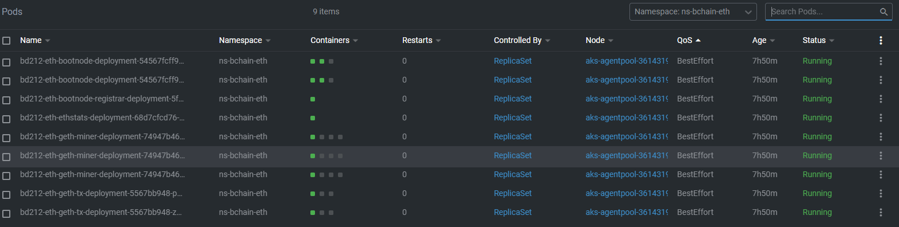

Para crear una cuenta:

```
geth attach http://localhost:8545

> personal.newAccount("BaseDatos")
```

Este comando devuelve la dirección de la cuenta:
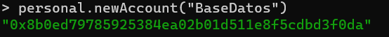

Comenzamos a minar:


```
> miner.setEtherbase("0x8b0ed79785925384ea02b01d511e8f5cdbd3f0da")
> miner.start()
```

Y vemos en nuestro dashboard como empiezan a generarse bloques:

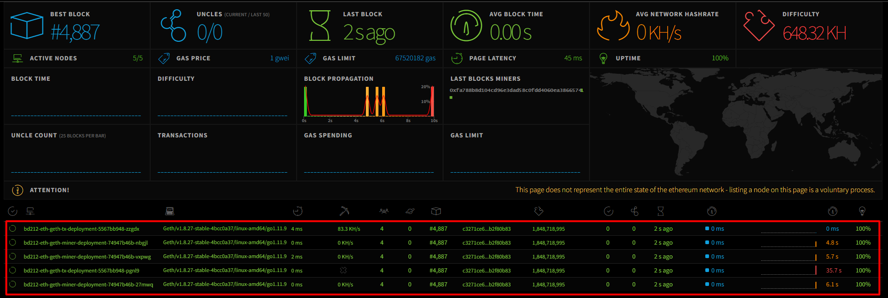
*http://20.75.251.58/*

Inicialmente vamos a crear el contrato para los NFT. Es para crear e intercambiar NFT. Para esto hacemos uso del lenguaje *Solidity*.

Podemos ver el contrato en [MyNFT](contratos/MyNFT.sol)

Para ejecutarlo, vamos hacer uso de un IDE para blockchain de Ethereum, Remix IDE.

[https://remix.ethereum.org/](https://remix.ethereum.org/)

Por defecto, el workspace ya tiene contratos listos para ejecutar. Los borramos y cargamos nuestro contrato.

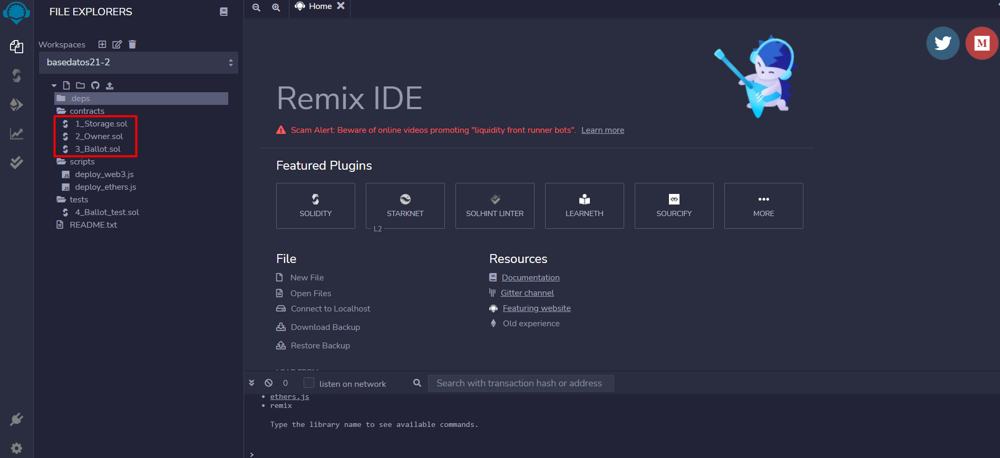


Automaticamente el IDE instala las dependecias, y veríamos algo similar:

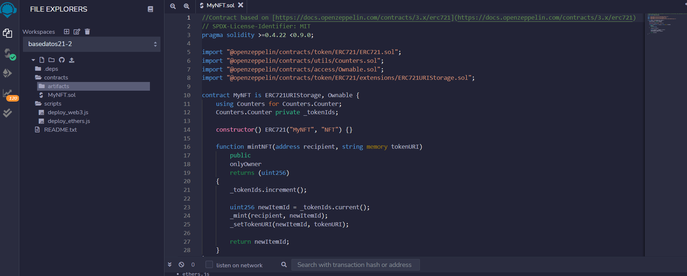

En seguida, para instalar el contrato debemos asociar nuestra blockchain privada:

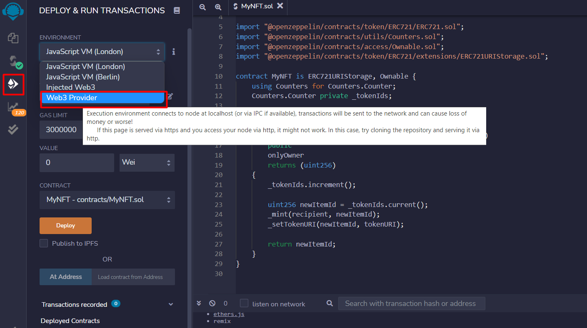

Y agregamos nuestro servidor rpc:

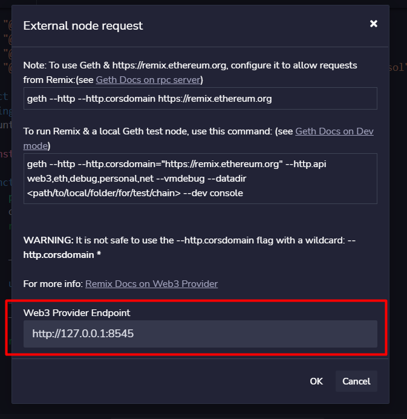

Y seleccionamos la cuenta, el contrato y desplegamos:

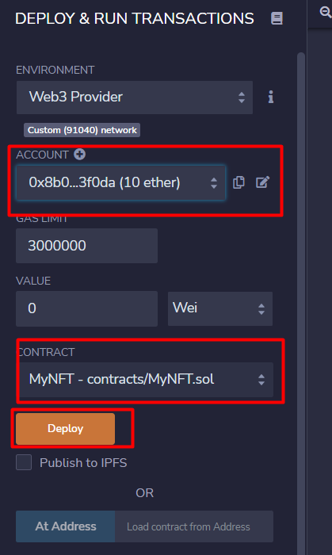

Una vez este desplegado, se listara el contrato con sus acciones:

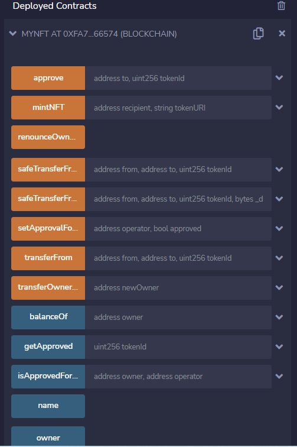

Para crear un NFT, necesitamos tener la imagen, junto con su metadata en una url. Para esto usamos *pinata*: https://app.pinata.cloud/

Una vez creada la cuenta, subimos una imagen y copiamos el CID.

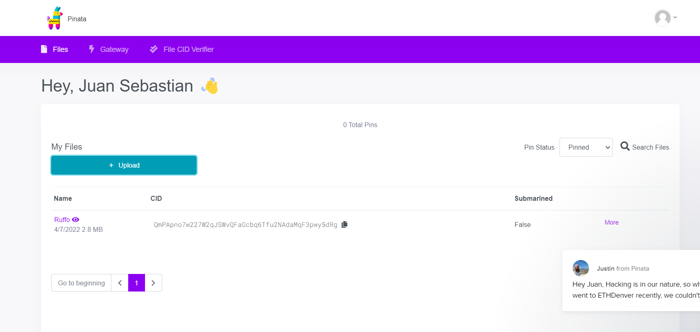

En Remix, seleccionamos minNFT y añadimos nuestro adress y el cid que copiamos de pinata y generamos la transacción. Vemos que la transacción es exitosa

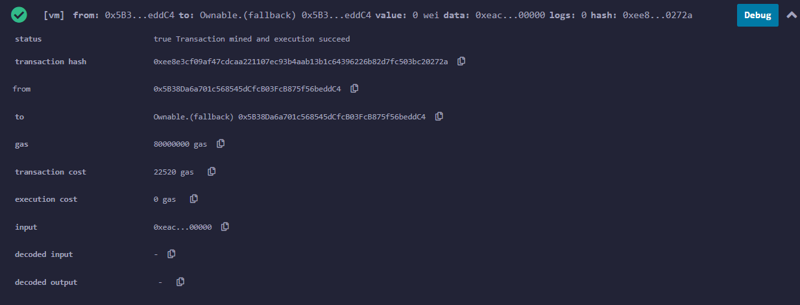


# TODO

Interfaz grafica para permitir la creación de nft's